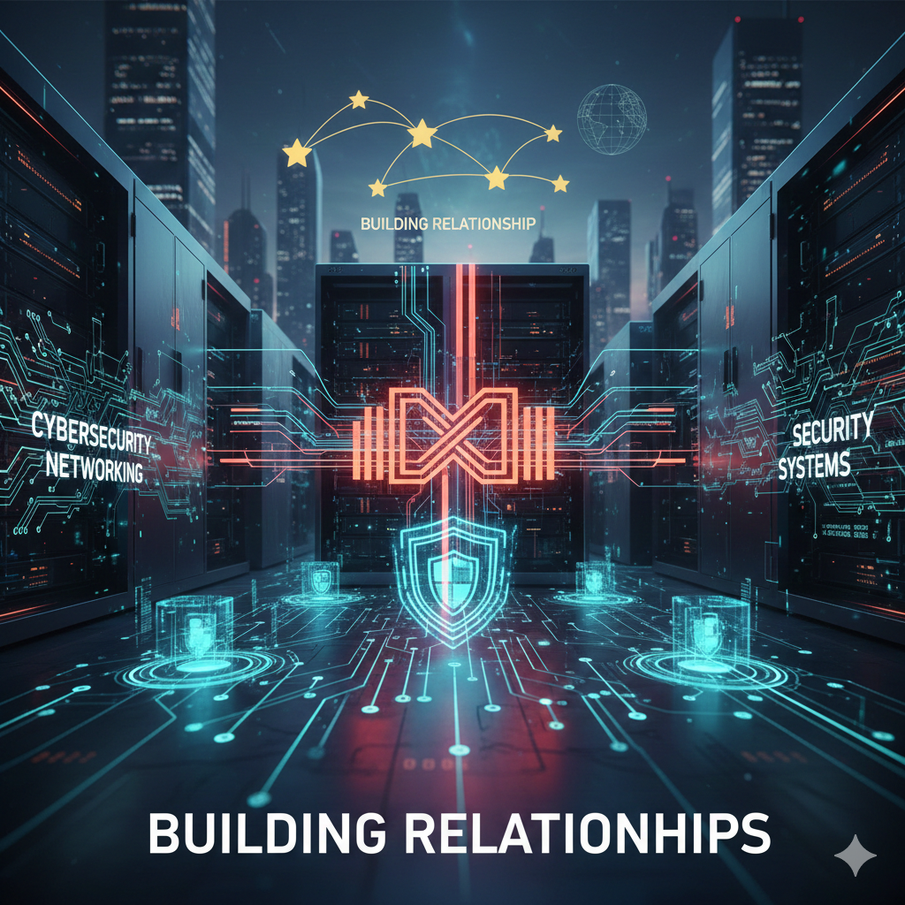

<p align="center">
  
</p>

<h1 align="center">👋 Hi, I'm Juan Yébenes</h1>

<p align="center">
  <b>IT Specialist · Networking & System Security · AWS</b>
</p>

<p align="center">
  
  
  
</p>

---

### 🧑‍💻 About me
```yaml
name: Juan Yébenes
pronouns: He/Him
role: IT Specialist
skills:
  - Network Administration
  - Cybersecurity 
  - Cloud (AWS)
  - Troubleshooting & Support
  - Customer-Oriented IT Solutions
education:
  - CCT College Dublin
